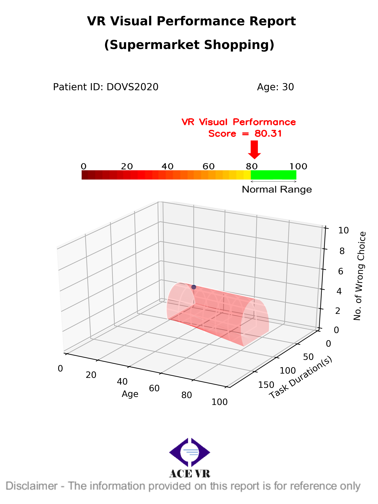

## Sample report generated in this function

## Usage example 

Input:  
    test_type (string): 'Supermarket' or 'City Navigation - Night' or 'City Navigation - Day'  
    ID (string): patient_id  'HKE001'. 
    age (int): '20'  
    duration (float): '30.2'  
    wrong_num (int): the wrong select choice or hit time  
    path (string): the full path of the folder to save reports  
    txt_file_name(string): the name of the target txt or csv file generated from Unity demo  
    date_time (string or date type): the test date '2012-01-01'  
  
Return:  
    no returns, but generate reports into target folder  

    from utils.gen_report import generate_report

    generate_report('Stair Navigation - Night', 'Philip', 30, 43, 1, './x/x/x', './x/x/x', '2012-01-01')

## Requirements
Described in requirements.txt. Can be installed by:  

    pip install -r requirements.txt

## Copyright
The copyright belongs to ACE Virtual Reality Ltd, Hong Kong, CHINA
